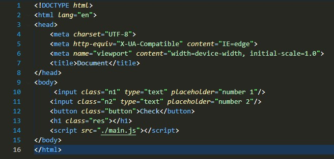

# DOM-Document Object Model

## Take div 

### HTML

### CSS

### Java Script

How to Access Attributes and Elements in CSS?

(tajik language)
Чӣ тавр ба атрибутҳо ва элементҳо дар CSS дастрасӣ пайдо кардан мумкин аст?

### HTML

### CSS

### Java Script

## Events

### HTML

### Java Script

## createElement()

The JavaScript document.createElement() method allows you to create and return a 
new element (an empty Element node) with the specified tag name.

(tajik language)
Усули JavaScript document.createElement() ба шумо имкон медиҳад, ки а эҷод ва баргардонед.

