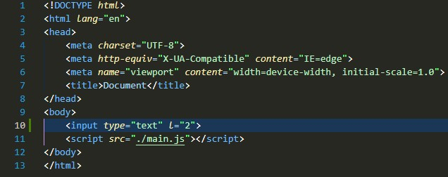

# DOM-Document Object Model

## Take div 

### HTML

### CSS

### Java Script

How to Access Attributes and Elements in CSS?

(tajik language)
Чӣ тавр ба атрибутҳо ва элементҳо дар CSS дастрасӣ пайдо кардан мумкин аст?

### HTML

### CSS

### Java Script

